# Guida utente - TerAgenda

Guida pratica per installare, avviare e utilizzare TerAgenda, passo per passo, sia lato medico (via API/Swagger) sia lato paziente (via interfaccia web).

---

## 0. Prerequisiti

- Python 3.10 o superiore installato
- `pip` disponibile da terminale
- Un browser web

---

## 1. Installazione

```bash
git clone https://github.com/chess-rocker/TerAgenda.git
cd TerAgenda

# (consigliato) crea un ambiente virtuale
python -m venv venv   # su Mac/Linux potrebbe servire "python3" al posto di "python"
source venv/bin/activate      # su Windows: venv\Scripts\activate

pip install -r requirements.txt
```

> Se ottieni un errore di conflitto tra `passlib` e `bcrypt`, verifica che `requirements.txt` contenga `bcrypt==4.0.1` (versione fissata proprio per evitare quell'incompatibilità).

---

## 2. Avvio del backend

```bash
uvicorn app.main:app --reload
```

Il backend è ora raggiungibile su:
- API: `http://127.0.0.1:8000`
- Documentazione interattiva Swagger: `http://127.0.0.1:8000/docs` ← **usala per tutte le operazioni lato medico**

Al primo avvio viene creato automaticamente il file `teragenda.db` (SQLite) nella cartella del progetto.

---

## 3. Avvio del frontend (lato paziente)

Il frontend è fatto di semplici file HTML/CSS/JS. Potresti pensare di aprire `login.html` con un doppio click, ma è meglio evitarlo: aperto così, l'indirizzo nel browser diventa `file:///...` e in alcuni browser le richieste che la pagina fa verso il backend (`http://127.0.0.1:8000`) possono non funzionare correttamente.

**Soluzione**: si "pubblica" la cartella `frontend/` con un piccolo server locale, così l'indirizzo diventa `http://127.0.0.1:5500/...` invece di `file:///...`, ed è coerente con l'indirizzo del backend.

Per farlo, apri un **secondo terminale** (lascia il primo, con `uvicorn` in esecuzione, così com'è) e digita:

```bash
cd frontend
python -m http.server 5500
```

*(Su Windows, se dà errore, prova `py -m http.server 5500`. Su Mac/Linux è spesso `python3 -m http.server 5500`.)*

Questo comando avvia un mini server web già incluso in Python (non serve installare nulla). Il terminale resterà "occupato" a mostrare i log delle richieste: è normale, va lasciato aperto finché usi l'app, esattamente come il terminale di `uvicorn`.

A questo punto avrai **due terminali aperti in parallelo**:
- uno con `uvicorn app.main:app --reload` → il backend, sulla porta 8000
- uno con `python -m http.server 5500` (su Windows, se serve: `py -m http.server 5500`) → il frontend, sulla porta 5500

Apri quindi nel browser: `http://127.0.0.1:5500/login.html`

*(In alternativa puoi usare l'estensione "Live Server" di VS Code, che fa la stessa cosa con un click.)*

> Se invece apri `login.html` con doppio click e nel tuo browser funziona comunque, va benissimo così: il server locale è solo una precauzione per evitare problemi, non un passaggio obbligatorio se già funziona senza.

---

## 4. Flusso completo: dal medico al paziente

### 4.1 Registrazione dei due utenti

Vai su `http://127.0.0.1:8000/docs`, apri **POST /register** → "Try it out" e registra due utenti, uno alla volta:

**Medico:**
```json
{
  "nome": "Dr. Rossi",
  "email": "medico@test.com",
  "password": "password123",
  "ruolo": "medico"
}
```

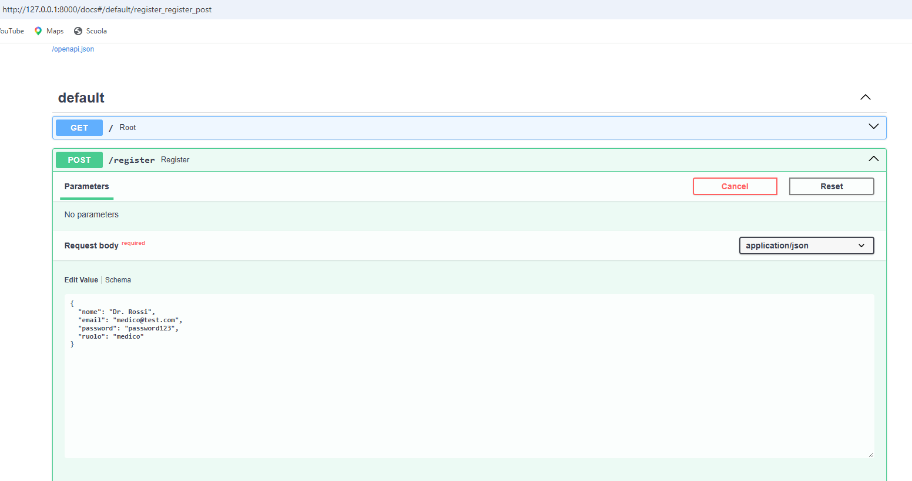

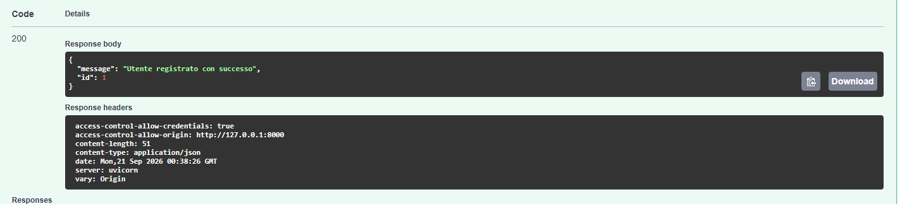

**Paziente:**
```json
{
  "nome": "Mario Bianchi",
  "email": "paziente@test.com",
  "password": "password123",
  "ruolo": "paziente"
}
```

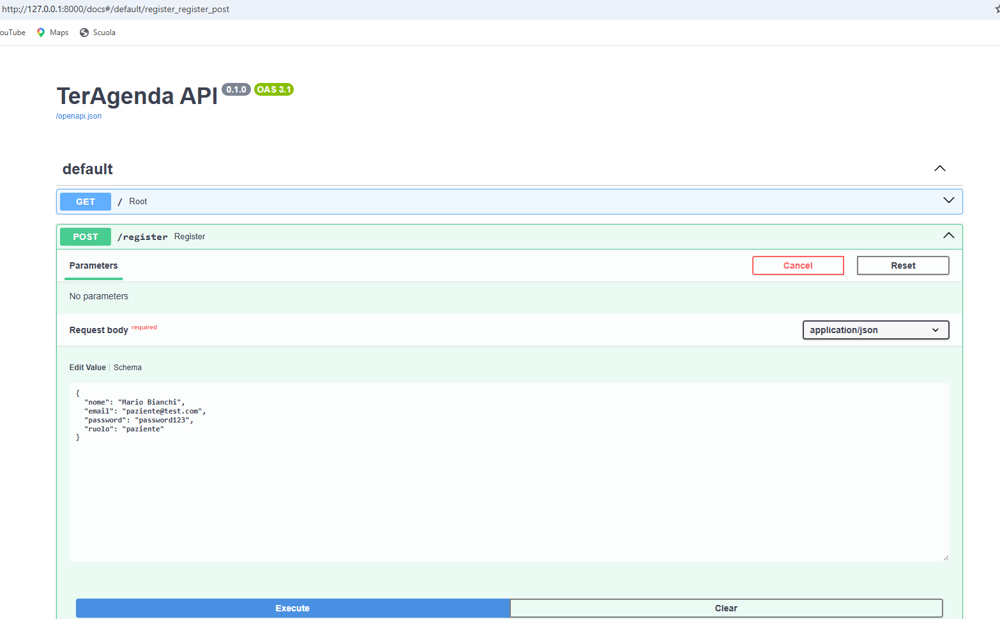

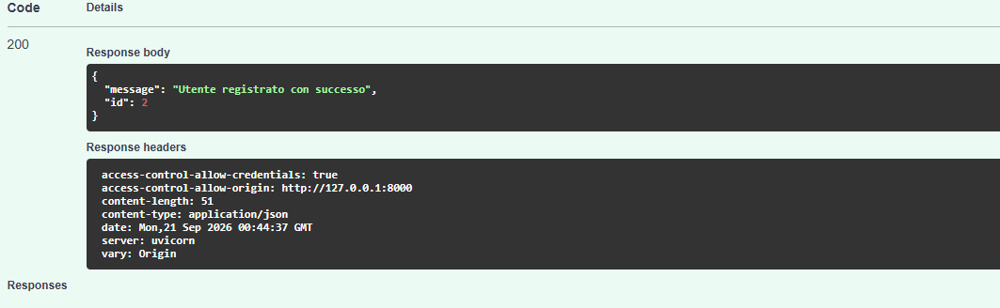

### 4.2 Login del medico e ottenimento del token

Su Swagger, apri **POST /login** con:
```json
{ "email": "medico@test.com", "password": "password123" }
```

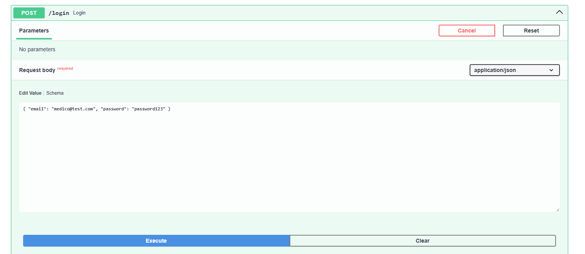

Nella risposta vedrai qualcosa come:

```json
{
  "message": "Login effettuato con successo",
  "user_id": 1,
  "ruolo": "medico",
  "access_token": "eyJhbGciOiJIUzI1NiIsInR5cCI6IkpXVCJ9.eyJzdWIiOiIxIn0.abc123...",
  "token_type": "bearer"
}
```


**Copia solo il valore di `access_token`** (la lunga stringa tra virgolette che inizia con `eyJ...`, senza includere le virgolette) — non serve copiare tutto il resto della risposta.

Per usarlo su Swagger: cerca il pulsante **"Authorize"** (ha un'iconcina a forma di lucchetto 🔒), posizionato in alto a destra nella pagina `/docs`, sopra l'elenco degli endpoint. Cliccalo: si apre un campo di testo dove devi incollare **solo il token puro, senza scrivere nulla davanti**, ad esempio:

```
eyJhbGciOiJIUzI1NiIsInR5cCI6IkpXVCJ9.eyJzdWIiOiIxIn0.abc123...
```

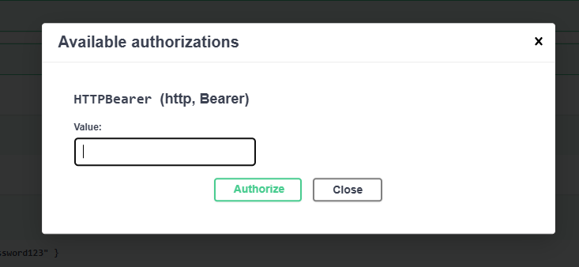

*(Non scrivere tu la parola "Bearer": Swagger la aggiunge automaticamente davanti al token quando invia la richiesta. Se scrivi "Bearer" anche tu, il risultato è un doppio "Bearer" che il server rifiuta con l'errore "Token non valido".)*

Da questo momento Swagger invierà automaticamente il token su ogni chiamata autenticata.

Inoltre puoi accedere già alla Dashboard vuota, testando le credenziali di accesso aprendo il link  `http://127.0.0.1:5500/login.html` grazie al server nella cartella frontend che abbiamo preparato all'inizio.

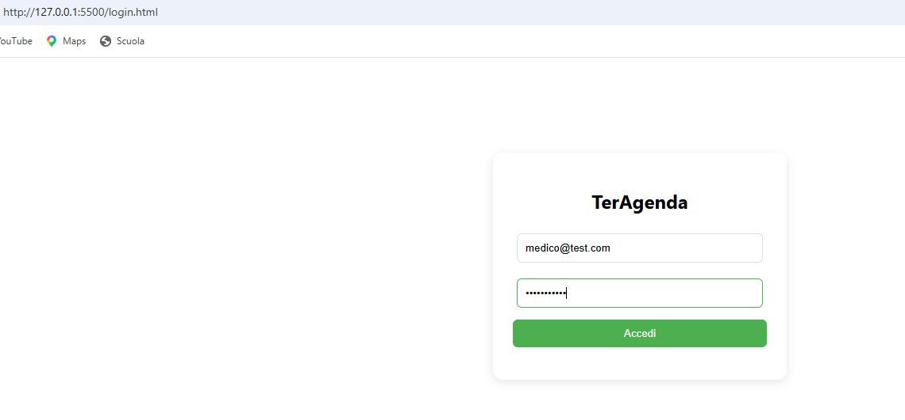

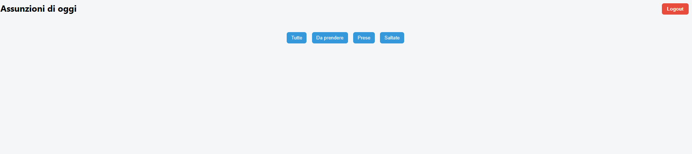

### 4.3 (Opzionale) Creazione di un farmaco

Con il token del medico attivo, apri **POST /farmaci**:
```json
{ "nome": "Paracetamolo", "descrizione": "Antidolorifico/antipiretico" }
```

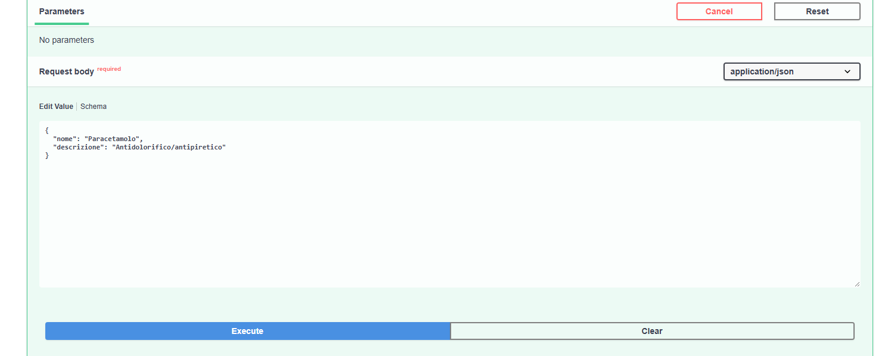

Annota l'`id` restituito (es. `1`): ti servirà al passo successivo.

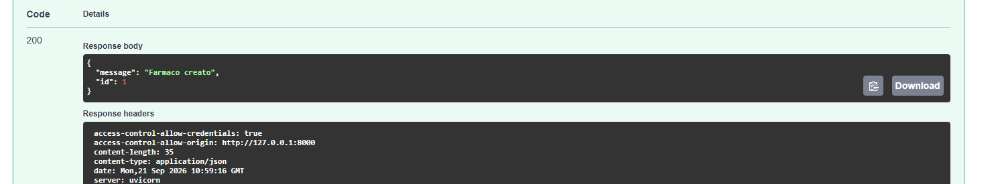

### 4.4 Il medico crea una terapia

Apri **POST /terapie**:
```json
{
  "paziente_id": 2,
  "medico_id": 1,
  "farmaco_id": 1,
  "data_inizio": "2026-09-21",
  "data_fine": "2026-09-23",
  "frequenza_giornaliera": 2,
  "note": "Assumere dopo i pasti"
}
```

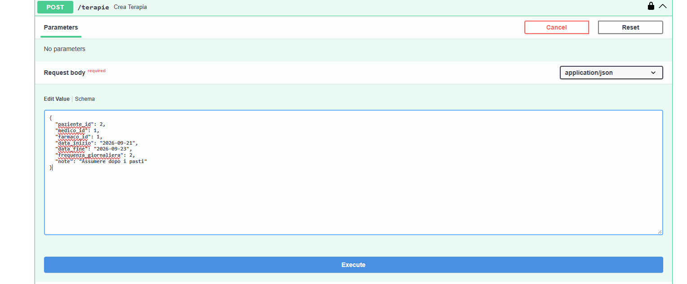

*(`paziente_id` e `medico_id` sono gli `id` restituiti dalla registrazione al punto 4.1 — di norma `1` per il primo utente registrato, `2` per il secondo.)*

Il sistema genera **automaticamente** tutte le assunzioni previste (in questo esempio: 3 giorni × 2 dosi = 6 assunzioni), distribuite nella giornata in base alla frequenza indicata.

### 4.5 (Opzionale) Firma digitale della terapia

Apri **PUT /terapie/{terapia_id}/firma**, inserisci l'`id` della terapia appena creata e conferma. Solo il medico che l'ha creata può firmarla.

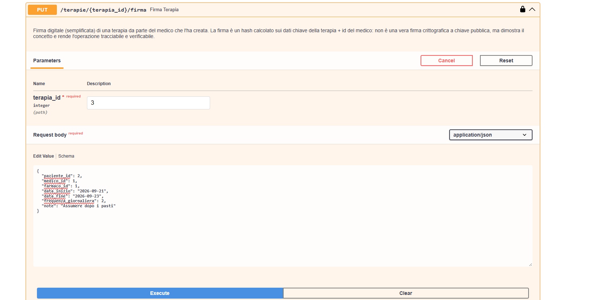


### 4.6 Il paziente accede alla dashboard

Torna al browser su `http://127.0.0.1:5500/login.html` e accedi con:
```
Email: paziente@test.com
Password: password123
```

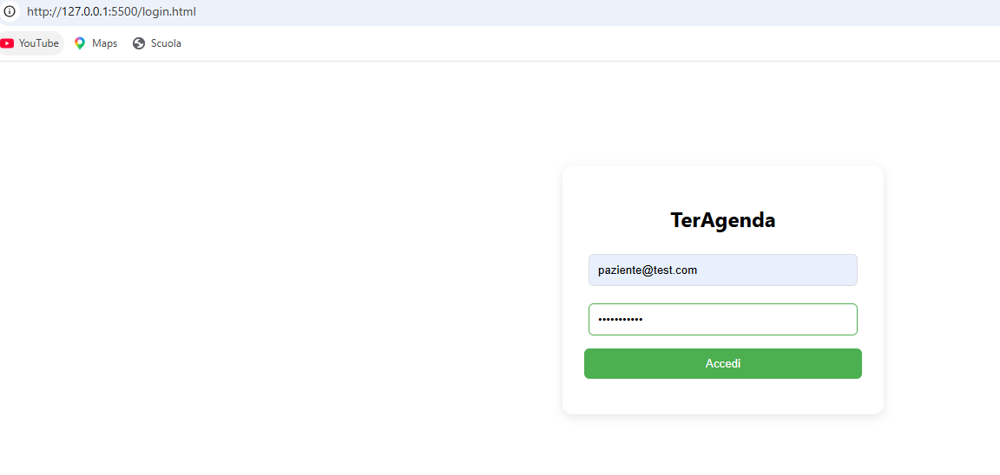


Verrai reindirizzato automaticamente a `dashboard.html`, dove vedrai le assunzioni previste **per la giornata odierna** (nell'esempio sopra, solo quelle con `data_inizio` = oggi verranno mostrate — usa una data odierna se vuoi vederle subito in dashboard).

### 4.7 Uso della dashboard

- I pulsanti in alto (**Tutte / Da prendere / Prese / Saltate**) filtrano la vista senza ricaricare la pagina.
- Su ogni assunzione, i pulsanti **✔ Presa** e **✖ Saltata** aggiornano lo stato in tempo reale (chiamano `PUT /assunzioni/{id}` con il token del paziente salvato automaticamente al login).
- **Logout** in alto a destra cancella il token e torna al login.

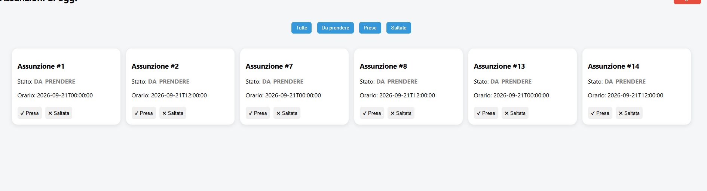

---

## 5. Riepilogo ruoli e permessi

| Azione | Chi può farla |
|---|---|
| Registrarsi, fare login | Chiunque |
| Creare/modificare/eliminare farmaci | Solo medico |
| Creare una terapia | Solo medico (a proprio nome) |
| Firmare una terapia | Solo il medico che l'ha creata |
| Vedere/filtrare le proprie assunzioni | Medico o paziente (autenticato) |
| Aggiornare lo stato di un'assunzione | Qualsiasi utente autenticato |

Tutte le operazioni protette richiedono l'header `Authorization: Bearer <token>`; senza token → `401`, con ruolo sbagliato → `403`.

---

## 6. Problemi comuni

| Problema | Causa probabile | Soluzione |
|---|---|---|
| Errore 500 su login/registrazione | Incompatibilità `passlib`/`bcrypt` | Verifica `bcrypt==4.0.1` in `requirements.txt` e reinstalla |
| Dashboard vuota | Le assunzioni create non cadono nella data odierna | Crea una terapia con `data_inizio` = data odierna |
| "Credenziali errate" al login | Email/password sbagliate o utente non registrato | Ripeti la registrazione da Swagger |
| Dashboard non carica nulla / redirect continuo al login | Token assente o scaduto (validità 8 ore) | Rifai il login |
| Errore CORS nel browser | Frontend aperto come `file://` invece che via server locale | Usa `python -m http.server` (o `py -m http.server` su Windows) come indicato al punto 3 |
| `python3 non riconosciuto` (Windows) | Su Windows il comando si chiama di solito `python`, non `python3` | Usa `python -m http.server 5500`, oppure `py -m http.server 5500` |

---

## 7. Comandi rapidi (riepilogo)

```bash
# Terminale 1 - backend
source venv/bin/activate
uvicorn app.main:app --reload

# Terminale 2 - frontend
cd frontend
python -m http.server 5500   # su Windows, se serve: py -m http.server 5500
```

Poi:
- Swagger (medico): `http://127.0.0.1:8000/docs`
- App (paziente): `http://127.0.0.1:5500/login.html`
